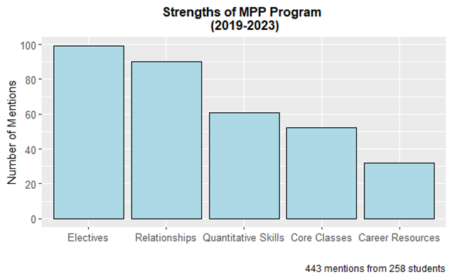

# Sam Newman

##### Data Analyst | Education Policy 

## Main Projects 
### Qualitative Projects 
-Thematic analysis of survey data. Cleaned, analyized and visualized data (n=269) for a university. 
[Code](https://github.com/samuelnewman03/Portfolio-Projects/blob/main/Qualitative%20Project_Program%20Strengths.Rmd)
 

### Quantiative Projects 

### Other Projects 

### Writing Samples 
